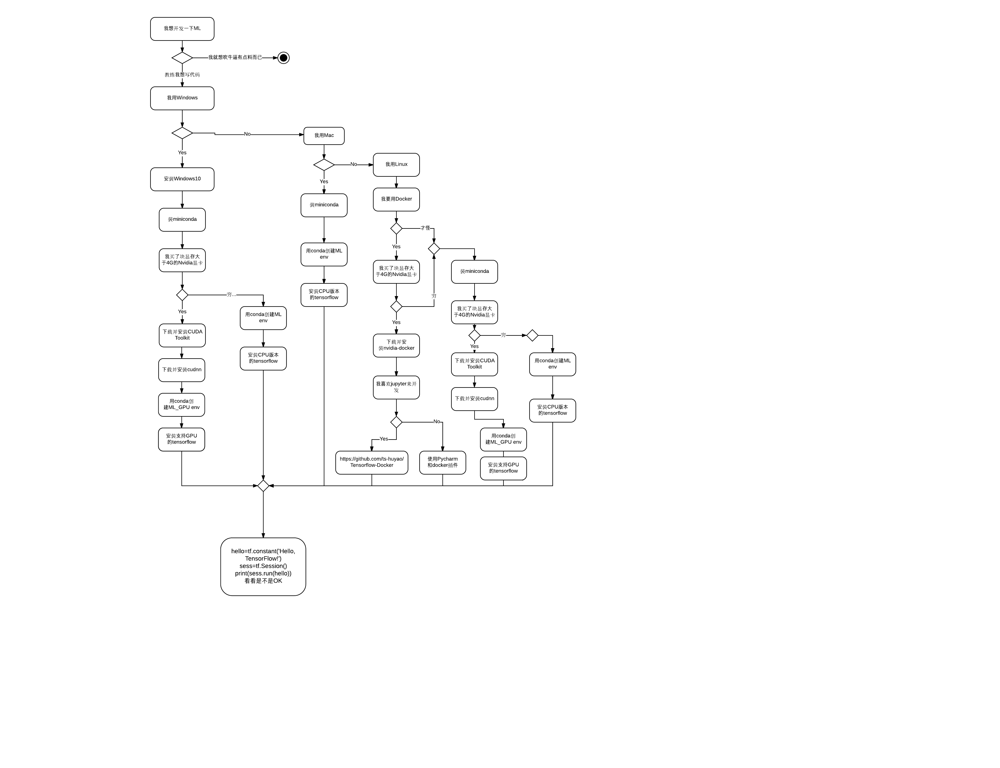

# AI-Club

## 怎样选择合适的开发平台



## 怎样搭建开发环境

### MAC

1. 安装 [miniconda](https://conda.io/miniconda.html)
2. Conda 环境

    * 最简单的
    ```sh
    conda env create --file ./aiclub_mac.yaml
    source activate aiclub
    ```
    * 或者
    ```sh
    conda config --add channels https://mirrors.tuna.tsinghua.edu.cn/anaconda/pkgs/free/
    conda config --set show_channel_urls yes
    conda create -n aiclub python=3.6
    source activate aiclub
    conda install pandas scikit-learn scikit-image scipy matplotlib sympy jupyter nb_conda -y
    pip install --ignore-installed --upgrade https://storage.googleapis.com/tensorflow/mac/cpu/tensorflow-1.4.0-py3-none-any.whl
    pip install tflearn
    ```
3.
```sh
jupyter notebook --ip='*' --NotebookApp.token= --port=8888
```
4. OK

### Windows
1. 安装 [miniconda](https://conda.io/miniconda.html)
2. Conda 环境
    * 直接导入GPU版本
    ```sh
    conda env create --file ./aiclub_win_gpu.yaml
    source activate aiclub
    ```
    * 或者直接导入GPU版本

    ```sh
    conda env create --file ./aiclub_win_cpu.yaml
    source activate aiclub
    ```
    * 当然从头自己装也行
    ```sh
    conda config --add channels https://mirrors.tuna.tsinghua.edu.cn/anaconda/pkgs/free/
    conda config --set show_channel_urls yes
    conda create -n aiclub python=3.6
    activate aiclub
    conda install pandas scikit-learn scikit-image scipy matplotlib sympy jupyter nb_conda -y
    ```
    下边CPU版本或是GPU版本只需要安装一个，GPU需要Windows安装好CUDA Toolkits并且安装好CUDNN

    1. GPU版本
    ```sh
    pip install --ignore-installed --upgrade tensorflow-gpu
    pip install tflearn
    ```
    2. CPU版本
    ```sh
    pip install --ignore-installed --upgrade tensorflow
    pip install tflearn
    ```
3.
```sh
jupyter notebook --ip='*' --NotebookApp.token= --port=8888
```
4. OK